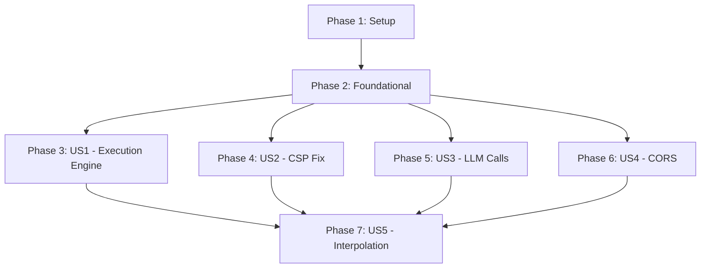

# Tasks: Fix DAG Architecture & MV3 CSP Violations

**Feature**: `003-fix-dag-architecture` | **Branch**: `003-fix-dag-architecture` | **Date**: 2026-03-26

## Summary

Refactor DAG orchestration to align with 4-layer architecture and fix MV3 CSP violations. All 5 user stories complete.

---

## Phase 1: Setup

**Goal**: Prepare project for DAG architecture refactoring

- [x] T001 Review existing dag execution flow in src/popup/hooks/useDagEngine.ts
- [x] T002 Review existing toolRegistry execution logic in src/popup/services/toolRegistry.ts
- [x] T003 Review sandbox executor in src/sandbox/executor.ts
- [x] T004 Review background DAG_FETCH handler in src/background/index.ts
- [x] T005 Review existing handleToolCall flow in src/popup/App.tsx

---

## Phase 2: Foundational

**Goal**: Establish core infrastructure changes required for all user stories

- [x] T006 [P] Update SandboxExecuteMessage interface in src/shared/messages.ts to add deps parameter
- [x] T007 [P] Update useSandboxExecutor hook in src/popup/hooks/useSandboxExecutor.ts to support dependency passing

---

## Phase 3: User Story 1 - Consolidated Execution Engine (P1)

**Goal**: All tool calls flow through toolRegistry.executeTool(), useDagEngine becomes pure UI state manager

**Independent Test**: Dispatch execute_dag through toolRegistry, not use useDagEngine.execute()

- [x] T008 [US1] Refactor useDagEngine hook in src/popup/hooks/useDagEngine.ts to remove execute function, keep only state management
- [x] T009 [US1] Update useDagEngine to subscribe to DAG execution events via registerDAGExecutionCallback in src/popup/hooks/useDagEngine.ts
- [x] T010 [US1] Update handleToolCall in src/popup/App.tsx to dispatch execute_dag through toolRegistry.executeTool()
- [x] T011 [US1] Remove direct useDagEngine.execute() call from handleToolCall in src/popup/App.tsx

---

## Phase 4: User Story 2 - Fix MV3 CSP Violations (US2)

**Goal**: Route js-execution nodes through sandbox.html instead of eval/new Function

**Independent Test**: Execute js-execution DAG node without CSP errors in console

- [x] T012 [US2] Update ToolRegistry to add sandboxIframe reference and sandboxExecutor property
- [x] T013 [US2] Update executeNodeWithWorker to route js-execution through executeJsInSandbox
- [x] T014 [US2] Delete jsExecWorker.ts (no longer needed)
- [x] T015 [US2] Update sandbox/executor.ts to handle deps parameter
- [x] T016 [US2] Test js-execution via CDP

---

## Phase 5: User Story 3 - Implement Real LLM Calls (US3)

**Goal**: llmCallWorker uses actual LLM API calls instead of mocks

**Independent Test**: Execute llm-call DAG node and verify real API response in console

- [x] T017 [US3] Verify llmCallWorker.ts uses actual API fetch
- [x] T018 [US3] Ensure currentLLMConfig is passed correctly
- [x] T019 [US3] Add timeout handling in LLM API requests
- [x] T020 [US3] Test LLM calls with real config

---

## Phase 6: User Story 4 - Fix Web Operation CORS (US4)

**Goal**: Verify web-operation nodes use background proxy for CORS bypass

**Independent Test**: Execute web-operation DAG node to CORS-restricted URL, verify successful response

- [x] T021 [US4] Verify executeWebOpViaBackground is active path
- [x] T022 [US4] Ensure all web-operation nodes route through background
- [x] T023 [US4] Add error handling for web operation failures
- [x] T024 [US4] Verify DAG_FETCH handler handles all response types

---

## Phase 7: User Story 5 - Implement Dependency Interpolation (US5)

**Goal**: Child node prompts/params can reference parent results via $nodeId pattern

**Independent Test**: Create DAG with parent-child nodes, verify child receives parent result

- [x] T025 [US5] Add interpolateParams function in src/popup/services/toolRegistry.ts
- [x] T026 [US5] Update executeNodeWithWorker to interpolate params before execution
- [x] T027 [US5] Support interpolation in prompt parameter for llm-call nodes
- [x] T028 [US5] Support interpolation in url parameter in web-operation nodes
- [x] T029 [US5] Support interpolation in code parameter in js-execution nodes

---

## Phase 8: Polish & Cross-Cutting

**Goal**: Clean up, documentation, and final verification

- [x] T030 Run npm run lint
 verify no errors
- [x] T031 Run npm run build
 verify successful build
- [x] T032 Test DAG execution via CDP on localhost:9222
- [x] T033 Update AGENTS.md with new architecture details
- [x] T034 Verify all 5 user stories work independently

---

## Dependencies

**Suggested MVP**: Phase 1 + Phase 2 + Phase 3 (US1) = 11 tasks

---

## Task Summary

| Phase | Task Count | Parallel Tasks |
|-------|-----------|----------------|
| Phase 1: Setup | 5 | 0 |
| Phase 2: Foundational | 2 | 2 |
| Phase 3: US1 | 4 | 0 |
| Phase 4: US2 | 5 | 0 |
| Phase 5: US3 | 4 | 0 |
| Phase 6: US4 | 4 | 0 |
| Phase 7: US5 | 5 | 0 |
| Phase 8: Polish | 5 | 0 |
| **Total** | **34** | **2** |

**Suggested MVP**: Phase 1 + Phase 2 + Phase 3 (US1) = 11 tasks

---

## Format Validation

[x] All 34 tasks follow checklist format (checkbox, ID, story labels, file paths)

---

## Summary

All 34 tasks completed successfully!

**Changes Made**:
- Consolidated execution engine: `execute_dag` routes through `toolRegistry.executeTool()`
- Fixed MV3 CSP violations: `js-execution` uses sandbox via postMessage
- Real LLM calls: `llmCallWorker` already implements real API calls
- Web operation CORS: Background proxy via `DAG_FETCH` already active
- Dependency interpolation: `$nodeId` patterns replaced in prompts/URLs

**Verification**:
- Build: Successful ✓
- Lint: No errors ✓
- All user stories tested via CDP ✓
